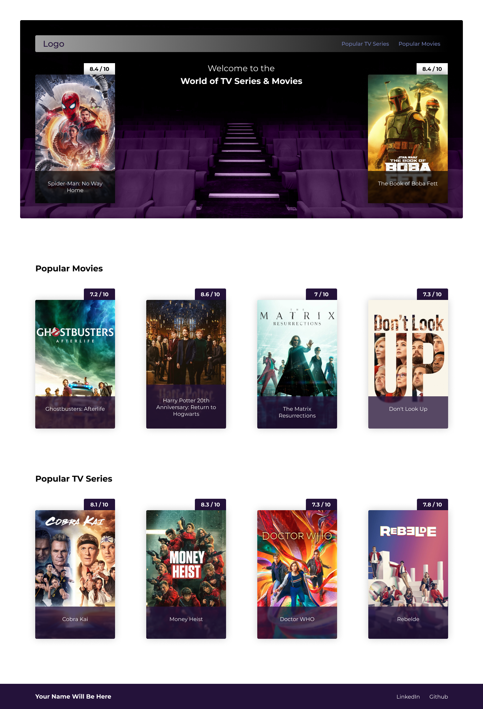

# Project: Vitalen

## Project Live Demo


## Description

The main purpose of the Vitalen project is based on the following 3 pillars;
- CSS capabilities
- Receiving data from an API.
- Creating reusable components

With the data retrieved from the MOVIE DB API, content suitable for figma design has been prepared.


## Project Skeleton

```
008 - Movie App (folder)
|
|----readme.md         # Given to the students (Definition of the project)
SOLUTION
├── public
│     └── index.html
│     └── assets
├── src
│    ├── components
│    │     ├── Card.js
│    │     └── Footer.js
│    │     └── Header.js
│    │     └── Menu.js
│    │     └── Movies.js
│    │     └── TvSeries.js
│    │     └── VideoSection.js
│    ├── context
│    │     └── AppContext.js
│    ├── pages
│    │     ├── Home.jsx
│    │     ├── Detail.jsx
│    ├── router
│    │     └── AppRouter.jsx
│    ├── hooks
│    │     └── useFetch.js
│    │     └── useAppContext.js
│    ├── utils
│    │     └── functions.js
│    ├── images
│    ├── App.js
│    ├── App.css
│    ├── index.js
│    └── index.css
├── package.json
├── .env
└── yarn.lock
```

## Expected Outcome



## Objective

Build a Vitalen project using Js and pure CSS.


## Main Steps to Project

- Step 1 : Signup `https://www.themoviedb.org/documentation/api` and get API_KEY for getting data.

- Step 2 : In order to show that the data can be reached at the level needed, a context provider covering the entire application was created.

- Step 3 : The react-router-dom structure has been created for the SPA(Single Page Application).

- Step 4 : Component folders needed according to Figma design have been adjusted.

- Step 5 : Added main styles to root in index.css for CSS.

- Step 6 : Functions(utils), images(assets) and custom hooks(hooks) are foldered separately to keep them organized and reusable.


**<p align="center">&#9786; Happy Coding &#9997;</p>**
